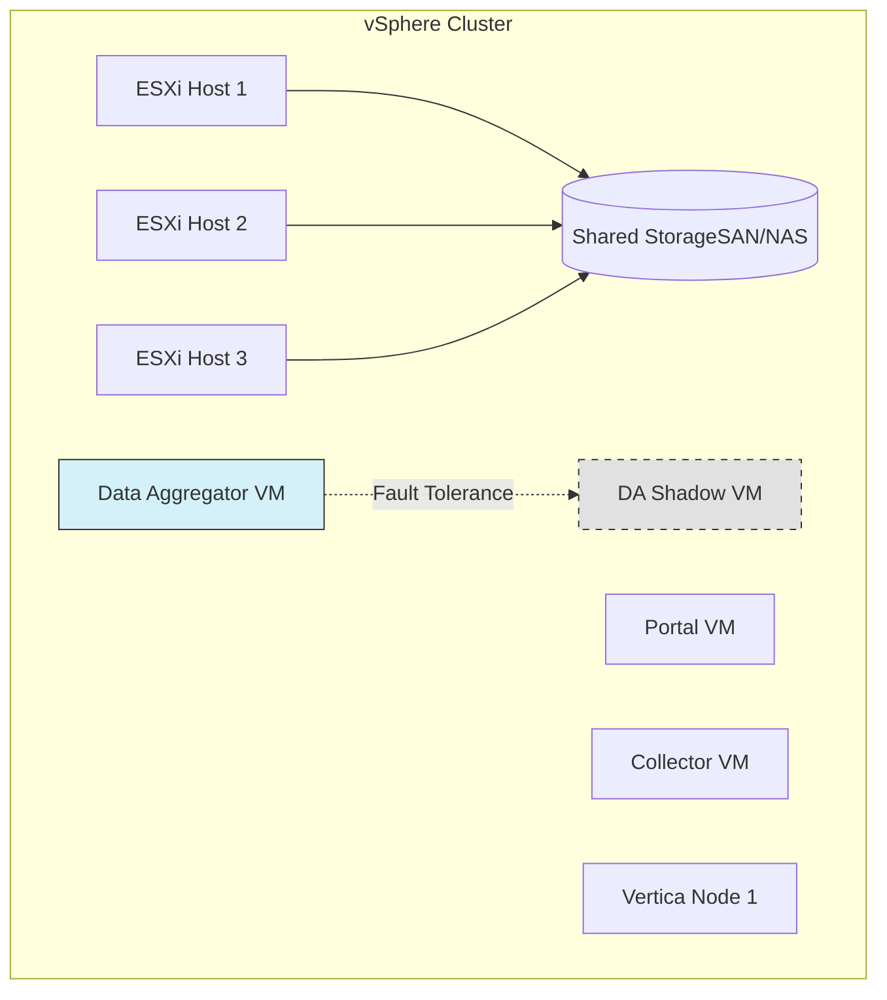

# DxNetOps High Availability
## A Cost-Effective VMware vSphere Solution

**Broadcom DxNetOps + VMware vSphere**

---

# Executive Summary

**Objective:** Achieve High Availability (HA) and Disaster Recovery (DR) for Broadcom DxNetOps without the prohibitive cost of duplicate physical hardware.

**Solution:** Leverage **VMware vSphere HA** and **Fault Tolerance (FT)** to provide infrastructure-level resilience.

**Outcome:**
- Reduced Hardware Costs
- Simplified Management
- Near-Zero RTO for Critical Components

---

# The Challenge: Traditional Physical HA

Deploying DxNetOps on bare metal requires:
- **Double Hardware:** 1-to-1 mapping for Active/Standby clusters.
- **Complex Licensing:** Idle standby licenses often required.
- **Manual Failover:** Physical failover can be complex and slow.
- **High TCO:** Significant CapEx and OpEx for minimal resilience gain.

---

# The Solution: Virtualized Resilience

By virtualizing DxNetOps on VMware vSphere, we shift resilience from the *Application* layer to the *Infrastructure* layer.

### Key Technologies
1.  **vSphere HA:** Automatic restart of VMs on healthy hosts.
2.  **vSphere Fault Tolerance (SMP-FT):** Instant failover with zero data loss.
3.  **vMotion:** Zero-downtime maintenance.

---

# Architecture Overview

---

# Deep Dive: Component Strategy

| Component | Strategy | RTO (Recovery Time) | Why? |
| :--- | :--- | :--- | :--- |
| **Data Aggregator** | **vSphere Fault Tolerance** | **Zero** | Critical polling engine; cannot tolerate gaps. |
| **Performance Center** | **vSphere HA** | Minutes | Web UI availability is critical but can tolerate distinct reboot. |
| **Data Collectors** | **vSphere HA** | Minutes | Distributed design buffers data during outages. |
| **Vertica DB** | **vSphere HA + Anti-Affinity** | Minutes | Database consistency is priority; Anti-affinity ensures K-safety. |

---

# Vertica on VMware: Best Practices

To ensure bare-metal performance for the Data Repository:

*   **100% Memory Reservation:** Prevent swapping/ballooning.
*   **Anti-Affinity Rules:** Ensure Vertica nodes *never* share a physical host.
*   **Paravirtual SCSI (PVSCSI):** Low CPU overhead for high I/O.
*   **Thick Provision Eager Zeroed:** Eliminate first-write latency.

---

# Cost-Benefit Analysis

| Feature | Physical Active-Active | VMware vSphere Solution |
| :--- | :--- | :--- |
| **CapEx (Hardware)** | $$$$ (2x Full Stack) | $$ (Shared Pool) |
| **OpEx (Power/Cooling)** | $$$$ | $$ |
| **Licensing** | Application Standby Licenses | vSphere Standard/Enterprise |
| **Complexity** | High (Custom Scripts) | Low (Native feature) |

---

# Conclusion

Adopting a **VMware vSphere-based HA architecture** for Broadcom DxNetOps offers the optimal balance of:

1.  **Resilience:** Enterprise-grade protection (up to 99.99%).
2.  **Simplicity:** No complex application clustering to manage.
3.  **Cost Efficiency:** Maximizes hardware utilization.

**Recommendation:** Proceed with virtualized deployment using Fault Tolerance for the Data Aggregator and HA for all other components.
